# 《光储充智能预测系统》V1.0

# 说明书

## 目录

1. 软件简介
2. 硬件和软件环境
3. 操作说明
   - (1) 进入主页
   - (2) 联合预测功能
   - (3) 数据探索功能
   - (4) 误差分析功能
   - (5) 气象数据功能
   - (6) 策略建议功能

---

## 1. 软件简介

《光储充智能预测系统》V1.0 是一款专为光储充一体化场站开发的智能预测与策略优化系统。本软件基于深度学习模型（TCN-Attention-LSTM 与 LSTM+GAN），结合实时气象数据，为用户提供光伏发电功率预测、充电负荷预测以及充放电调度策略建议。

《光储充智能预测系统》V1.0 的功能特点有：

- **联合预测**，支持光伏发电功率与充电负荷的联合预测，提供未来 15 分钟至 24 小时的多步预测结果，并展示净负荷曲线。
- **数据探索**，利用历史数据进行充电负荷的聚合分析，包括日负荷曲线、Pearson 相关系数分析以及小时级负荷画像。
- **误差分析**，提供充电模型与光伏模型的回测功能，展示预测值与真实值的偏差，包含残差分布图和按小时的误差分析。
- **气象数据**，通过 Open-Meteo API 获取实时气象数据（温度、辐照度、云量、降雨量），展示辐照度与云量趋势图，并自动判断天气预警。
- **策略建议**，基于分时电价（峰/平/谷三段）与光伏出力预测，自动生成充电调度策略建议，优化用电成本。

《光储充智能预测系统》V1.0 的技术特点有：

- **深度学习驱动**，充电模型采用 TCN-Attention-LSTM 混合架构，光伏模型采用 LSTM+GAN 对抗训练框架。
- **MC Dropout**，引入 Monte Carlo Dropout 进行不确定性估计，提供预测值的置信区间 (±2σ)。
- **模块化设计**，前后端分离，基于 BentoML 框架部署，便于扩展和维护。
- **数据驱动**，内置历史数据集，无需用户手动上传数据即可运行预测与分析。
- **用户友好**，界面简洁直观，支持深色/浅色主题切换，图表基于 Plotly 生成，交互性强。

---

## 2. 硬件和软件环境

- **CPU**：64 位 Intel i5 及以上，AMD Ryzen 5 及以上。
- **硬盘**：推荐 2G 以上可用空间。
- **内存**：4GB 以上（推荐 8GB 以上，用于深度学习推理）。
- **操作系统**：Windows 10 以上版本，或 Linux（Ubuntu 20.04+）。
- **应用软件**：
  - Python 3.10 及以上
  - 依赖包见 `requirements.txt`（含 PyTorch、BentoML、Plotly、Pandas 等）
  - 启动服务后通过浏览器访问

---

## 3. 操作说明

《光储充智能预测系统》V1.0 通过 BentoML 服务启动后，使用浏览器访问对应地址即可打开软件。

当打开《光储充智能预测系统》V1.0 后，具体操作如下：

---

### (1) 进入主页

主页如图 1 所示。

> **[TODO: 截图] 图 1 — 主页界面（联合预测 Tab 初始状态）**

主页面顶部为标题栏，展示系统名称、当前时间和服务状态。标题栏下方是 5 个 Tab 导航按钮：

- **📊 联合预测**：光伏 + 充电联合预测（默认显示）
- **💾 数据探索**：历史数据可视化分析
- **📉 误差分析**：模型回测与残差分析
- **☀️ 气象数据**：实时气象数据展示
- **💡 策略建议**：充放电调度策略

右上角提供主题切换（深色/浅色），页面底部显示 API 状态栏。

---

### (2) 联合预测功能

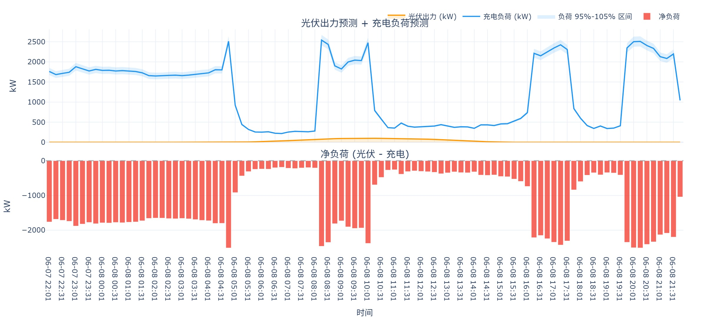

**图 2 — 联合预测主图（光伏出力 + 充电负荷 + 净负荷）**

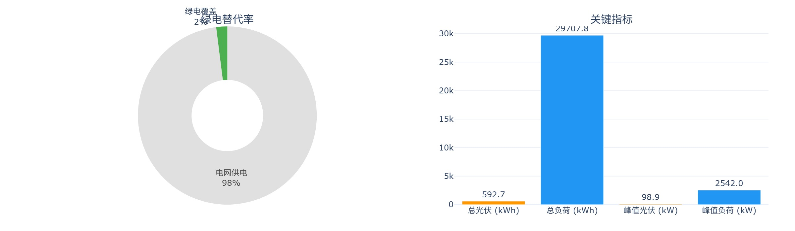

**图 2-1 — 联合预测摘要图（各时段调度策略分布）**

联合预测页面是系统的核心功能，左侧为控制面板，右侧展示预测结果。

**控制面板**包含以下操作项：

- **模型模式**：可选择"光伏 + 充电联合预测"、"仅光伏预测"或"仅充电预测"。
- **预测步数**：支持 15min 单步、1h 预测和 24h 预测三种步长。
- **当前电价**：输入当前电价（元/kWh），用于策略计算。默认 0.63 元/kWh。
- **当前充电负载**：输入当前充电负载（kW），作为预测起始点。默认 875 kW。
- **预测起始日期/小时/分钟**：自定义预测起始时间。
- **🔬 执行预测**：点击按钮运行预测模型。

**预测结果区域**包含：

- **KPI 指标卡**：展示总光伏发电量 (kWh)、总充电负荷 (kWh)、光伏峰值 (kW)。
- **光伏预测图**：展示光伏预测曲线与置信区间（±2σ 灰色阴影）。
- **充电负荷预测图**：展示充电负荷预测曲线与置信区间。
- **联合分布图**（如图 2）：综合展示光伏出力（橙色面积图）、充电负荷（蓝色线）和净负荷（红色虚线），底部包含时段电价色带（峰时红色、平时浅黄、谷时绿色）。
- **预测摘要图**（如图 2-1）：按填谷/消纳/削峰分类展示各时段的调度策略分布。

---

### (3) 数据探索功能

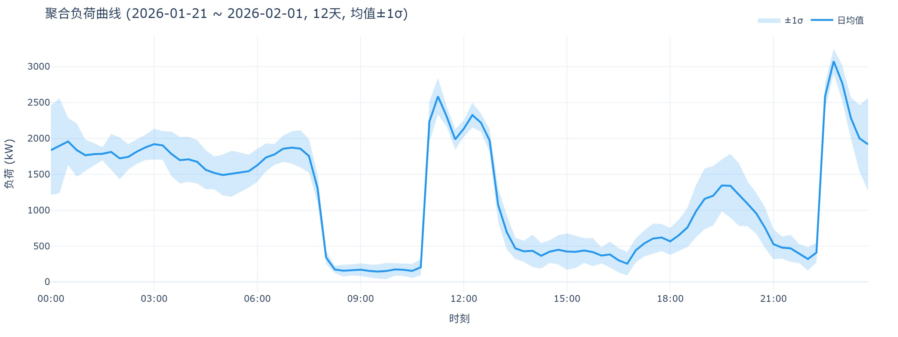

**图 3 — 聚合日负荷曲线（均值 ± 1σ）**

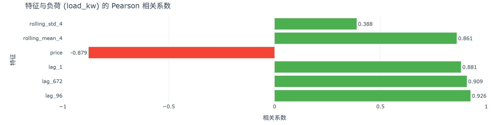

**图 3-1 — Pearson 相关系数分析图**

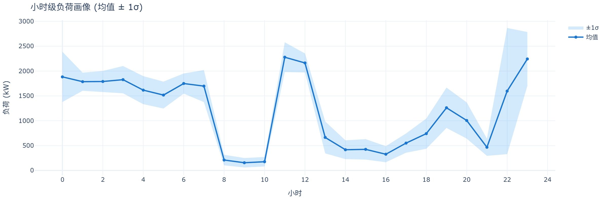

**图 3-2 — 小时级负荷画像（均值 ± 1σ）**

数据探索页面包含三张分析图表，无需任何操作即可自动加载：

- **📅 历史日负荷曲线**（如图 3）：支持两种查看模式——"聚合均值"展示日期范围内的均值与标准差（±1σ）；"单日聚焦"查看特定某一天的详细曲线。可通过日期选择器或快捷按钮（本周/本月/近7天/近30天）筛选时间范围。
- **📊 Pearson 相关系数分析**（如图 3-1）：展示各数值特征与充电负荷之间的 Pearson 线性相关系数，绿色表示正相关，红色表示负相关，按绝对值降序排列。
- **⏰ 小时级负荷画像**（如图 3-2）：按 24 小时分组统计历史充电负荷的均值与标准差，反映负荷的典型日变化模式。

---

### (4) 误差分析功能

> **[TODO: 截图] 图 4 — 误差分析页面整体界面（含控制面板与回测图）**

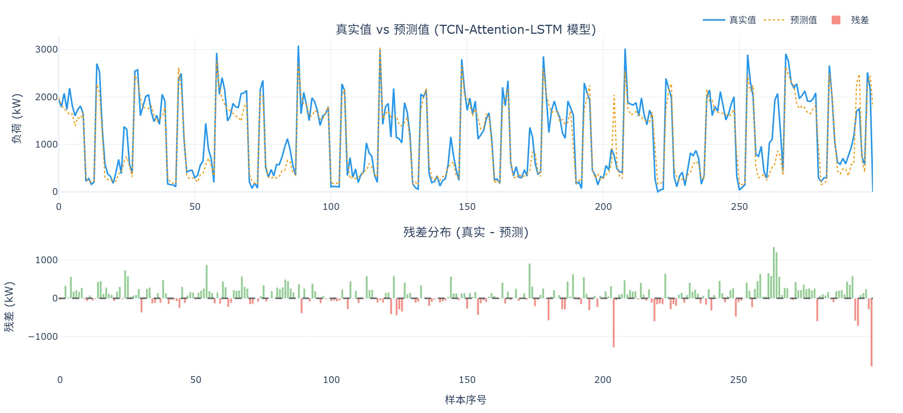

**图 4-1 — 充电回测图（预测值 vs 真实值）**

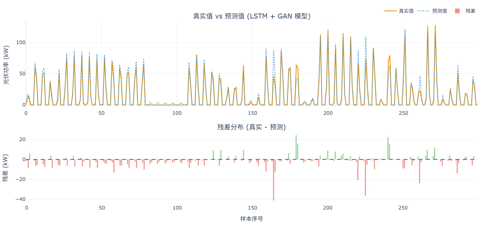

**图 4-2 — 光伏回测图（预测值 vs 真实值）**

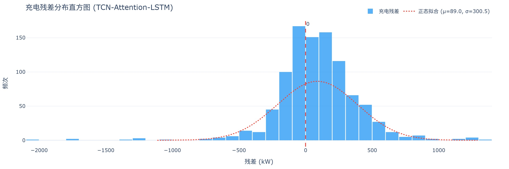

**图 4-3 — 充电残差分布图**

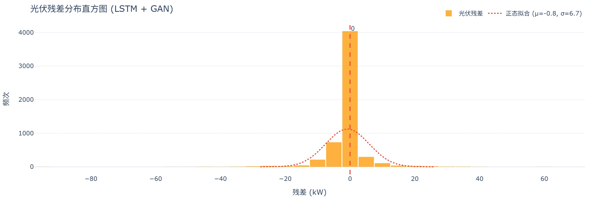

**图 4-4 — 光伏残差分布图**

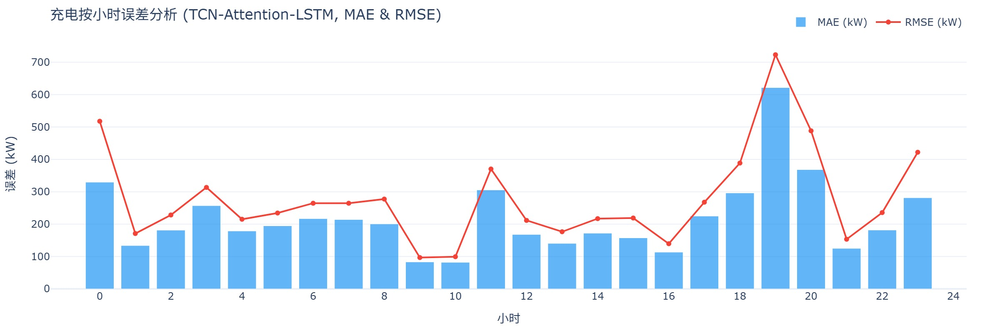

**图 4-5 — 充电按小时误差分析图**

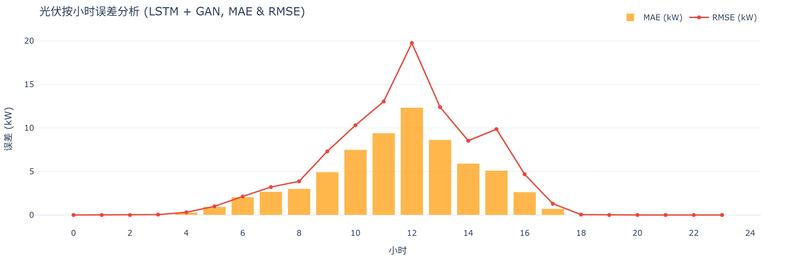

**图 4-6 — 光伏按小时误差分析图**

误差分析页面用于评估预测模型的准确性。左侧为控制面板，右侧展示回测结果。

**控制面板**包含：

- **🔌 充电回测**：点击按钮对充电模型进行回测，展示预测值与真实值的对比。
- **☀️ 光伏回测**：点击按钮对光伏模型进行回测。
- **误差指标**：显示回测后的 MAE、RMSE、MAPE 等指标。

**误差结果区域**包含三组图表：

- **回测图**（如图 4-1、4-2）：展示预测值与真实值的对比曲线，直观反映模型拟合效果。
- **残差分布图**（如图 4-3、4-4）：展示预测误差的分布直方图，叠加正态分布拟合曲线，评估误差是否呈正态分布。
- **按小时误差图**（如图 4-5、4-6）：按小时维度统计误差的均值与标准差（±1σ），帮助识别模型在特定时段的表现差异。

---

### (5) 气象数据功能

> **[TODO: 截图] 图 5 — 气象数据页面整体界面（含概览卡片与趋势图）**

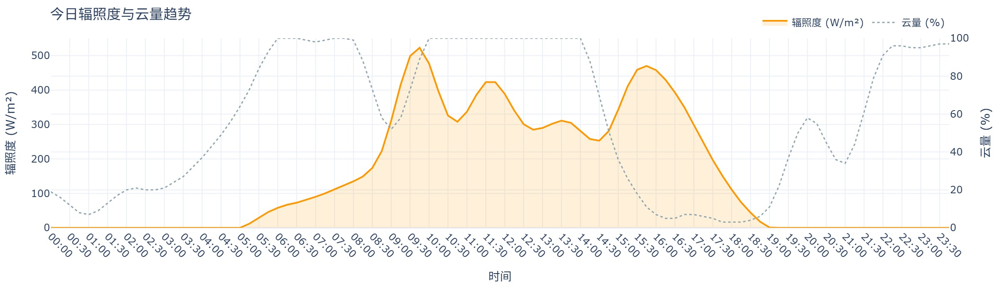

**图 5-1 — 辐照度与云量趋势图**

气象数据页面展示实时气象信息，点击 **🔄 刷新气象数据** 按钮获取最新数据（需要网络连接）。

- **气象概览卡片**：四宫格展示当前温度 (°C)、云量 (%)、辐照度 (W/m²) 和降雨量 (mm/h)。
- **天气预警**：自动判断降雨情况，当预计降雨量超过阈值时触发黄色预警，提示光伏出力可能骤降；天气正常时显示绿色标识。
- **辐照度与云量趋势图**（如图 5-1）：双 Y 轴图表，左轴为辐照度（橙色填充曲线），右轴为云量（灰色虚线），展示今日全天趋势，时间粒度为 15 分钟。

---

### (6) 策略建议功能

> **[TODO: 截图] 图 6 — 策略建议页面（生成策略后的完整界面）**

策略建议页面在完成联合预测后，点击 **📋 生成策略建议** 按钮即可生成充放电调度策略。

策略建议基于以下规则：

- **电价时段**：
  - 峰时 (08:00-11:00, 18:00-21:00)：电价 1.0 元/kWh
  - 平时 (06:00-08:00, 11:00-18:00, 21:00-22:00)：电价 0.6 元/kWh
  - 谷时 (00:00-06:00, 22:00-24:00)：电价 0.3 元/kWh

- **策略类型**：
  - **消纳光伏**：光伏出力大于充电负荷时，多余电量优先存储或上网，降低充电电价成本。
  - **填谷充电**：谷时电价时段，优先安排充电负荷，利用低价电降低运营成本。
  - **削峰降载**：峰时电价时段，减少非必要充电负荷，避免高价购电。

策略建议以表格或列表形式展示各时段的推荐操作和预期收益。

---

*文档结束*